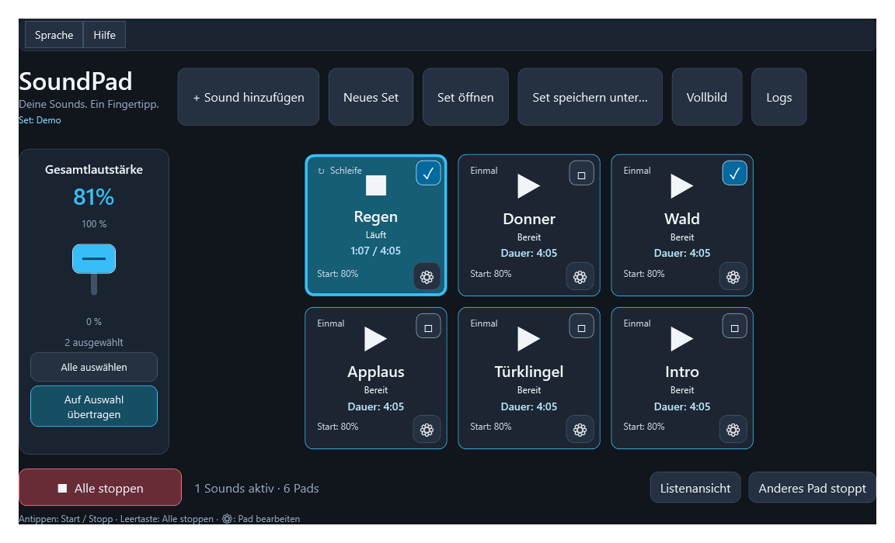

# SoundPad

[](https://github.com/4DCreative/SoundPad/actions/workflows/build.yml)
[](LICENSE)
[](https://github.com/4DCreative/SoundPad/releases/latest)

[Deutsch](#deutsch) · [English](#english) · [Changelog](CHANGELOG.md)

SoundPad is a touch-friendly Windows soundboard for playing WAV and MP3 files from large pads or a compact list.

> **AI-created project / KI-erstelltes Projekt**
>
> SoundPad was created entirely with AI assistance using OpenAI Codex, guided by the product decisions and feedback of [4DCreative](https://github.com/4DCreative). SoundPad wurde vollständig mit KI-Unterstützung durch OpenAI Codex erstellt, geführt durch Produktentscheidungen und Feedback von 4DCreative.

## Deutsch

### Überblick

SoundPad ist ein touchfreundliches Soundboard für Windows 11. WAV- und MP3-Dateien werden Pads zugeordnet und per Antippen gestartet oder gestoppt. Die Oberfläche ist für den Tablet-Modus ausgelegt und bietet eine Pad- sowie eine Listenansicht.

### Download

Die aktuelle Windows-x64-Version steht unter [GitHub Releases](https://github.com/4DCreative/SoundPad/releases/latest) bereit. Das ZIP-Paket ist eigenständig ausführbar und benötigt keine separate .NET-Installation.

### Vorschau



### Funktionen

- WAV- und MP3-Dateien importieren; mehrere Sounds dürfen gleichzeitig laufen.
- Start/Stopp per Pad oder gesamtem Eintrag in der Listenansicht; die Leertaste stoppt alle Sounds.
- Einmalige Wiedergabe oder Schleife pro Pad.
- Anzeige von Gesamtdauer und aktueller Position während der Wiedergabe.
- Startlautstärke, relative Pad-Lautstärke, Farbe und Name pro Pad konfigurierbar.
- Vertikale Gesamtlautstärke; sie kann auf markierte Pads als Startlautstärke übertragen werden.
- Wahlweise startet ein Pad zusätzlich oder beendet andere laufende Pads.
- Automatische Seiten für viele Pads, ohne Scrollbalken in der Pad-Ansicht; die Liste ist scrollbar.
- Sets als `.soundpadset` speichern, öffnen und wechseln. Das zuletzt geöffnete Set wird beim Start erneut geladen.
- Deutsch/Englisch über die obere Menüleiste und integrierte Hilfe.
- Strukturierte JSONL-Logs für Wiedergabe, Fehler und Diagnose.

### Schnellstart

**Voraussetzungen:** Windows 11, .NET 10 SDK sowie die Visual-Studio-Workload **.NET-Desktopentwicklung**. Visual Studio 2026 wird empfohlen.

1. `SoundPad.sln` in Visual Studio öffnen.
2. Nach einem frischen Clone Pakete wiederherstellen:

   ```powershell
   dotnet restore SoundPad.sln
   ```

3. Mit `F5` starten oder im Projektordner ausführen:

   ```powershell
   dotnet run --project src/SoundPad
   ```

`obj/project.assets.json` ist absichtlich nicht in Git enthalten. Es wird beim NuGet-Restore erzeugt.

### Bedienung und Daten

- **Sound hinzufügen** importiert eine oder mehrere WAV-/MP3-Dateien. Die Audiodateien werden nur referenziert und nicht kopiert.
- Das Zahnrad eines Pads öffnet dessen Einstellungen. **Pad entfernen** entfernt nur die Zuordnung.
- **Neues Set** erstellt ein leeres Set. Jede Änderung eines geöffneten oder gespeicherten Sets wird automatisch gespeichert; die vorherige Fassung wird als `.bak` gesichert.
- Bei nicht mehr erreichbaren Sounddateien das betreffende Pad entfernen und die Datei erneut hinzufügen.
- Logs liegen bei Projektstarts neben `SoundPad.sln` unter `logs`; ansonsten neben der Anwendung oder bei fehlenden Schreibrechten unter `%LOCALAPPDATA%\SoundPad\logs`.

### Audio und Grenzen

SoundPad streamt die Audiodateien abschnittsweise, rechnet sie in 48 kHz Stereo um und gibt sie über das Windows-Standardausgabegerät mit WASAPI Shared wieder. Auch längere Musikstücke werden daher nicht vollständig in den Arbeitsspeicher geladen. Schleifen wiederholen die gesamte Datei; diese Version bietet kein Crossfade, keine BPM-Synchronisierung und kein Time-Stretching.

### Prüfen

```powershell
dotnet build SoundPad.sln
dotnet run --project tests/SoundPad.Checks
```

Mit `--render` erzeugt die Prüfung eine WPF-Vorschau unter `artifacts`:

```powershell
dotnet run --project tests/SoundPad.Checks -- --render
```

## English

### Overview

SoundPad is a touch-friendly Windows 11 soundboard. Assign WAV or MP3 files to pads, then tap a pad to start or stop its sound. The interface is designed for tablet use and provides both a pad view and a compact list view.

### Download

The current Windows x64 build is available on [GitHub Releases](https://github.com/4DCreative/SoundPad/releases/latest). The ZIP package is self-contained and does not require a separate .NET installation.

### Preview


### Features

- Import WAV and MP3 files; multiple sounds can play at once.
- Start or stop from a pad or anywhere on a list row; press Space to stop all sounds.
- One-shot or loop playback per pad.
- Show total duration and the current playback position.
- Configure start volume, relative pad volume, color, and name for every pad.
- Vertical master volume control; apply its value as the start volume of selected pads.
- Choose whether a new pad plays alongside others or stops all other active pads.
- Automatic pages for many pads, without scrolling in pad view; list view can scroll.
- Save, open, and switch `.soundpadset` files. The last opened set is restored at launch.
- German/English language selection in the top menu and built-in help.
- Structured JSONL logging for playback, errors, and diagnostics.

### Getting started

**Requirements:** Windows 11, the .NET 10 SDK, and the **.NET desktop development** workload. Visual Studio 2026 is recommended.

1. Open `SoundPad.sln` in Visual Studio.
2. Restore packages after a fresh clone:

   ```powershell
   dotnet restore SoundPad.sln
   ```

3. Start with `F5`, or run this in the project folder:

   ```powershell
   dotnet run --project src/SoundPad
   ```

`obj/project.assets.json` is intentionally excluded from Git. NuGet creates it during restore.

### Usage and data

- **Add sound** imports one or more WAV/MP3 files. Audio files are referenced, never copied.
- Use a pad’s gear icon to edit it. **Remove pad** only removes the association.
- **New set** creates an empty set. Changes to an open or saved set are saved automatically, and the preceding version is kept as a `.bak` file.
- If an audio file is moved or unavailable, remove that pad and add the file again.
- Logs are written to `logs` next to `SoundPad.sln` when launched from the project; otherwise next to the application, or to `%LOCALAPPDATA%\SoundPad\logs` if required.

### Audio and limits

SoundPad streams audio in chunks, converts it to 48 kHz stereo, and plays it through the Windows default output device using WASAPI Shared. Longer music tracks therefore do not need to be fully loaded into memory. Loops repeat the complete file; this version does not include crossfading, BPM synchronisation, or time stretching.

### Verification

```powershell
dotnet build SoundPad.sln
dotnet run --project tests/SoundPad.Checks
```

Use `--render` to create a WPF preview in `artifacts`:

```powershell
dotnet run --project tests/SoundPad.Checks -- --render
```

## Versions and releases / Versionen und Releases

The complete history of user-visible changes is maintained in [CHANGELOG.md](CHANGELOG.md). Versions follow semantic versioning: `MAJOR.MINOR.PATCH`.

Die vollständige Liste der für Nutzende relevanten Änderungen steht in [CHANGELOG.md](CHANGELOG.md). Die Versionsnummern folgen dem Schema `MAJOR.MINOR.PATCH`.

## License / Lizenz

SoundPad is licensed under the [MIT License](LICENSE).

SoundPad steht unter der [MIT-Lizenz](LICENSE).

## Technology / Technik

- WPF on .NET 10
- NAudio 2.2.1
- WASAPI Shared audio output
- Visual Studio 2026
